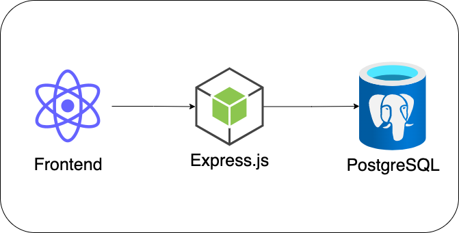
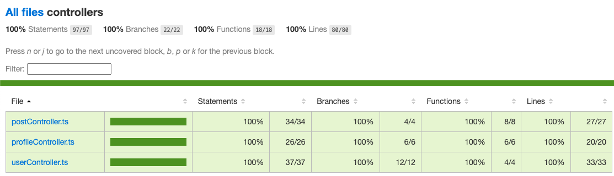

# community-noticeboard

## Overview

This is a simple networking forum for a local community. Members in the community and share their thoughts and connect with each other.


## Stack

1. frontend is running with React
2. backend is a RESTful API with express server
3. postgres is used as local database
4. typescript is used cross both frontend and backend service
5. docker (optional)



## Prerequisites:

1. nodejs (16+) for running backend and frontend service
2. install PostgreSQL (this is very important for running the stack locally, unless complete step 3)
3. if local PostgreSQL is not installed, a docker-compose file is provided, and run this docker-compose file (`docker compose up`) will pull down the docker postgres image and start the container

## Setup local dev

### create env config file

dotenv is used to manage env variables, rename the .envexample to .env and update env variable accordingly, the below values are the default values which align with for postgres docker image's env variables

```
JWT_SECRET = jwt_secret
POSTGRES_USERNAME = ocaluser
POSTGRES_PASSWORD = testpassword
POSTGRES_DB = postgres
POSTGRES_HOST = localhost
```

### install backend dependencies

```
npm install
```

### install frontend dependencies

```
cd frontend
npm install
```

### run app in development mode (frontend and backend)

```
npm run dev
```

once the dev is up and running. Frontend will run on `localhost:3000`, and backend will run on `localhost:5000`

a typical terminal will look like below


webpage will look like below


sample user login credential

| email            | password       |
| ---------------- | -------------- |
| annie@gmail.com  | passwordannie  |
| lisa@gmail.com   | passwordlisa   |
| arthur@gmail.com | passwordarthur |
| howard@gmail.com | passwordhoward |

## run test cases locally

## run backend test cases

```
npm run test:backend
```

21 test cases will run and generate the coverage report, looks like below





## run frontend test cases

```
npm run test:frontend
```

19 test cases will run and generate the coverage report, looks like below


## Frontend file structure

```
package.json           --> project info and dependencies packages
tsconfig.json          --> typescript config
src/
  app/
    hooks.ts           --> redux hooks
    stores.ts          --> redux store
  components/          --> reusable React components
  features/
    auth/              --> redux auth reducer, action and state
    post/              --> redux post reducer, action and state
    profile/           --> redux post reducer, action and state
  pages/               --> react pages
  test/                --> test cases
  App.tsx              --> main components defines all routes info
  index.tsx            --> entrypoint
  App.css              --> webapp's css
public/                --> static html pages and other assets
```

- Frontend web app fully use functional based components with Hooks
- react-router-dom is used for navigation between pages
- Redux Toolkit is used for state management and store configuration

## Frontend pages on different sizes

### singup and login page


### profiles page


### post page


### edit profile page


### profile detail page


## Frontend file structure

```
package.json           --> project info and dependencies packages
tsconfig.json          --> typescript config
.env                   --> env variable
.eslintrc.json         --> eslint config file
.prettierrc.json       --> prettier config file
test.config.ts         --> jest config file
postgres.sql           --> postgres database seeding script
docker-compose.yml     --> local docker postgres image and adminer
backend/
  controllers/         --> handler requests and return responses
  middleware/          --> auth middleware that checks if authorized
  routes/              --> route endpoints
  migrations/          --> db migration files for each table
  models/              --> postgres database models
  test/                --> test cases
  helper.ts            --> util functions
  index.tx             --> entrypoint
  server.ts            --> define express app and connect to database
  sequelize.ts         --> create sequelize instance
```

## Backend API endpoint

base path = `http://localhost:5000/api`

| HTTP method | url            | controller    | middleware  |
| ----------- | -------------- | ------------- | ----------- |
| POST        | /users/login   | loginUser     | NONE        |
| POST        | /users/        | registerUser  | NONE        |
| GET         | /profiles      | getProfiles   | requireAuth |
| GET         | /profiles/{id} | getProfile    | requireAuth |
| PUT         | /profiles/{id} | updateProfile | requireAuth |
| GET         | /posts         | getPosts      | requireAuth |
| POST        | /posts         | createPost    | requireAuth |
| DELETE      | /posts/{id}    | deletePost    | requireAuth |

- there are 3 main routes, `users` `profiles` and `posts`
- endpoints have input validation, and proper error handler with right status code (400,401,422)
- avatar is generated via API on `https://avatars.dicebear.com`

## Database

### Migration and Seed

- Sequelize is used as ORM, and migration and seeding is provided, read more on this [link](https://sequelize.org/docs/v6/other-topics/migrations/)
- if local database failed to seed, please use the `postgres.sql` file in root directory, execute this file will create table and insert the data
- if running docker-compose for postgres image, `postgres.sql` will be executed when the container start

### Users table

| field        | type         | notes                    |
| ------------ | ------------ | ------------------------ |
| email        | VARCHAR(255) | primary key              |
| profileId    | VARCHAR(255) | link to `Profiles` table |
| passwordHash | VARCHAR(255) | encrypted using bcrypt   |

### Profiles table

| field     | type         | notes       |
| --------- | ------------ | ----------- |
| profileId | VARCHAR(255) | primary key |
| name      | VARCHAR(255) |             |
| hobbies   | VARCHAR(255) |             |
| bio       | VARCHAR(255) |             |
| role      | VARCHAR(255) |             |

- social media link is not saved into database

### Posts table

| field     | type         | notes                    |
| --------- | ------------ | ------------------------ |
| postId    | VARCHAR(255) | primary key              |
| profileId | VARCHAR(255) | link to `Profiles` table |
| date      | VARCHAR(255) |                          |
| text      | VARCHAR(255) |                          |

### adminer

- adminer is a web-based database client management tool, it is also added in the `docker-compose.tml`, running on `localhost:8080`

- view table and rows in adminer


## Roadmap

- add more logging
- deploy on to cloud
- add comments on post
- save social media link into database
